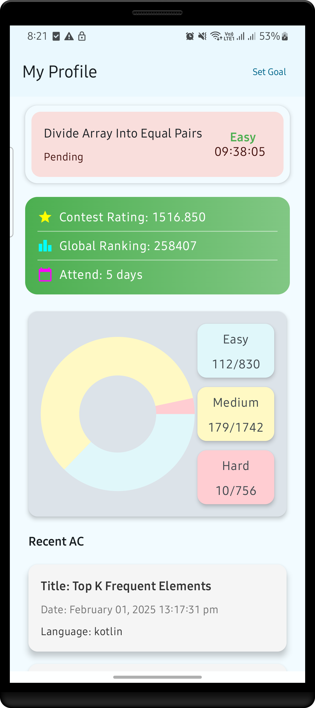
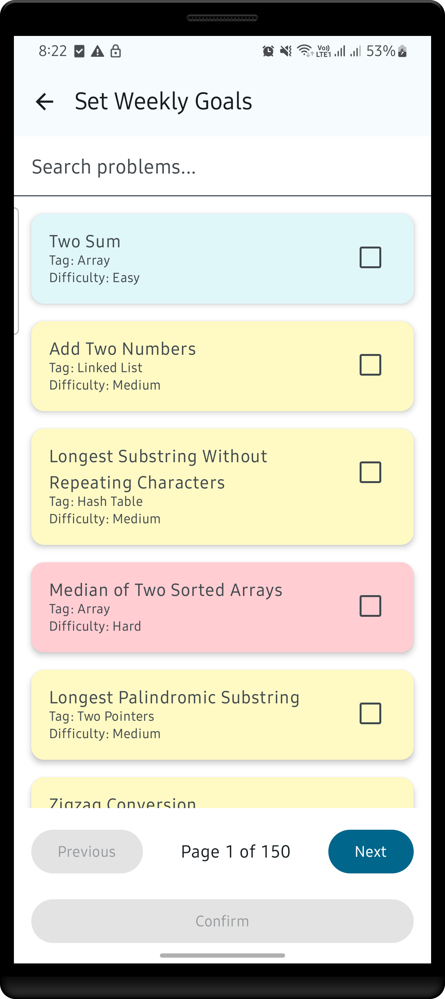
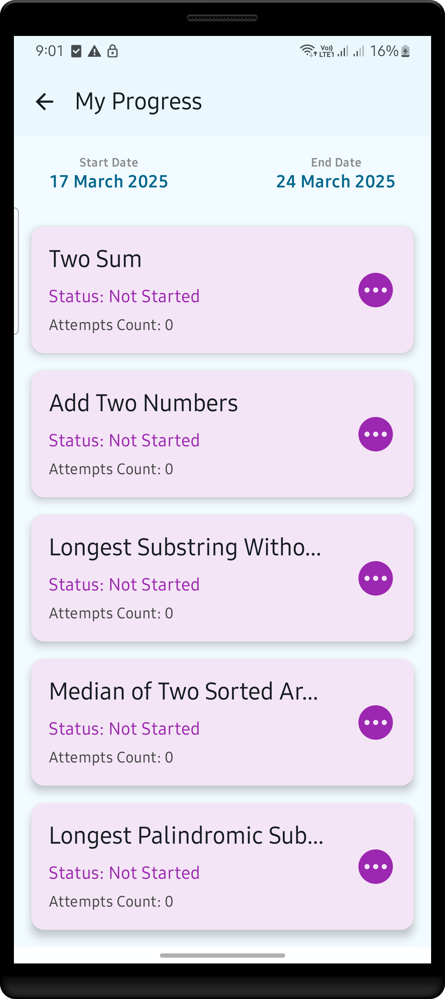

# LeetCode Android Client 📱
This is an unofficial native Android leetcode client that may help you to focus on your leetcode problem solving journey! This app has notification features that reminds you of leetcode daily problem if you did not solve a day.
Additionally, you can set your own weekly goal through this application and this app will remind you about your progress! And many more features are coming! 🚀

Get the APK: https://apkpure.com/leetcode-plus/com.byteutility.dev.leetcode.plus

## Key Features 🌟

- **Daily Reminder Notifications**: Stay on top of your coding practice with daily notifications based on your **LeetCode daily problem progress**.
- **Weekly Goals Tracking**: Set weekly problem-solving targets, track your progress, and stay motivated to achieve your goals.
- **Recent Submissions & User Stats**: Keep tabs on your latest Accepted submissions and view detailed user statistics from LeetCode.
- **Glance widget for quick access to the Problem of the Day**: Glance widget that lets you see the Problem of the Day right from your home screen—making it easier than ever to stay consistent with your problem-solving!

## Screenshots

    
    
    
    

## Built With 🛠️

This app leverages modern Android development technologies:

### 🖌️ UI
- **Jetpack Compose**: Build beautiful, declarative, and responsive UI with minimal code.

### 🔄 Asynchronous API Handling
- **Kotlin Coroutines**: Lightweight threads for efficient background processing.
- **Flow**: Stream data asynchronously and reactively.

### 🌐 HTTP Client
- **Retrofit**: Simple and efficient HTTP client for making network requests.

### 💾 Persistence
- **Androidx DataStore**: Store key-value pairs securely and efficiently.
- **Room Database**: Manage local SQLite database with ease.

### 🔄 Persistent Work
- **WorkManager**: Schedule background tasks to keep the app updated even when it's not in use.

### 🖼️ Image Loading
- **Coil**: Fast and modern image loading library for Compose.

### 🗂️ Dependency Injection
- **Hilt**: Streamline dependency injection and simplify code.

### 📊 Charts & Visualisations
- **Compose Charts**: Visualize your progress with beautiful charts.

## Privacy Policy

Leetcode Plus does not collect, store, or share any personal data. The app operates without requiring user registration or accessing sensitive information. Any permissions requested are solely for app functionality and are not used to collect personal information.

For any questions, contact us at nurshuvo51@gmail.com .

## License
This project is licensed under the [MIT License](LICENSE).
